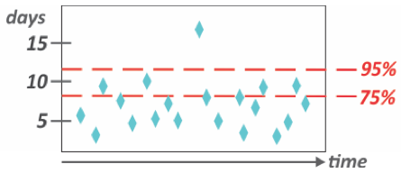
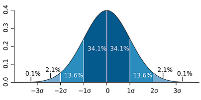

This chart shows how long each item took to be done.

# Delivery Variability Hub

According to David Anderson, a Kanban implementation has 5 Central Properties:

1. Visualize Work
2. Limit Work in Process
3. Measure & Manage Flow
4. Make Process Policies Explicit
5. Continuous Improvement

This extension focuses on item "3. Measure & Manage Flow". 
You can optimize your Kanban system to improve the smooth flow of work, collect metrics to analyze flow, and even get leading indicators of future problems by analyzing the flow of work.

 This chart apply simple statistics to the cycle times of items and determine confidence levels for how long new work is likely to take, and use this to set expectations with stakeholders.

In this example, 75% of the team's work items get done in around 8 days, and 95% in around 12 days.

This is based on [Bell Curve](http://www.investopedia.com/terms/b/bell-curve.asp#ixzz4MFdbietB). The bell curve is the most common type of distribution for a variable, and due to this fact, it is known as a normal distribution.

	